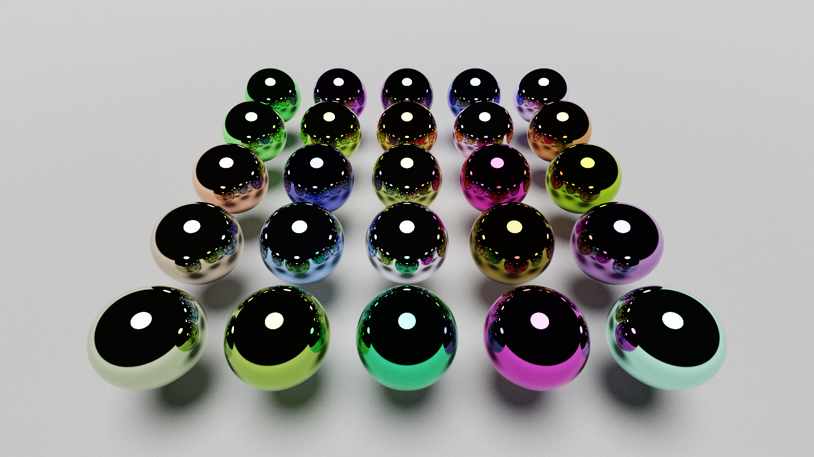
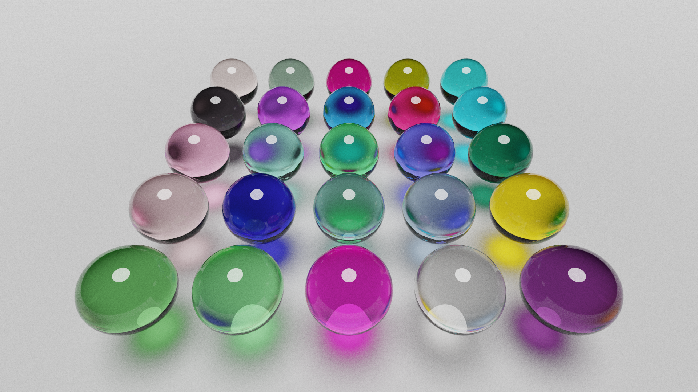
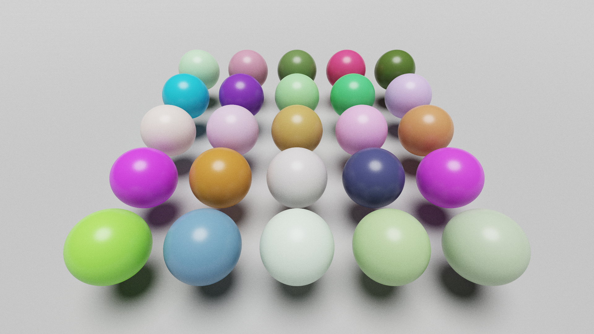
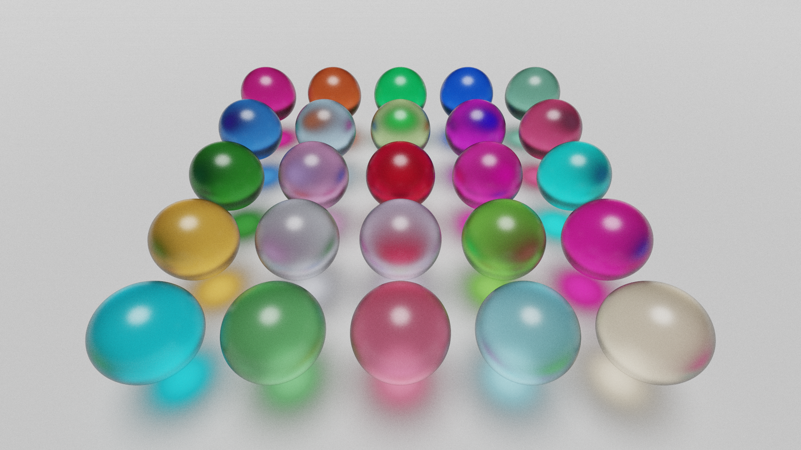
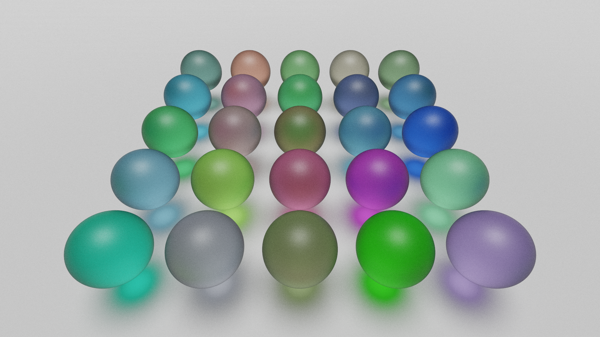

# RT_CPU

## Présentation

Ceci est une version ameliorée d'un projet de lancer de rayons sur CPU réalisé durant ma première année du master ISICG. Le projet consistait à créer de toute pièce un moteur de rendu offline basé sur du lancer de rayons.

Le moteur est ainsi capable de gérer différents types de géométrie :
- analytique : plan, sphère, triangle et triangle mesh
- implicite 2D :
- implicite 3D : plan, sphère, cube, cylindre, tore et certaines figures fractales
- fractale implicite 3D : Appolonius, Julia, MandelBulb, Menger et Sierpinki
- parametrique :

Le moteur intègre aussi deux méthodes de rendu : 
- direct lighting par sampling de primitive de lumière (directionelle, point, spot, sphérique)
- path tracing avec importance sampling

D'autres améliorations ont aussi été réalisées comme : 
- la création de structures accélératrices (AABB et BVH) qui ont pour vocation de grandement accélérer les calculs
- le support de différents types de caméra (orthographique et perspective)
- la gestion des matériaux transparents 

## Résultats

| Direct lighting | Path tracing  |
| - | - |
|  |  |

| Mandelbulb and julia set | Appolonius |
| - | - |
|  |  |

| Roughness | Dielectric | Metalic | Transmit |
| - | - | - | - |
| 0 |  |  |  |
| 0.3 |  |  |  |
| 0.5 |  |  |  |

# Future ajouts

Plusieurs ajouts sont en vue pour la géométrie dans ce moteur :
- l'ajout de nouveau type de géométrie analytique : landskape, micro-mesh, text
- le refactor du type de géométrie analytique "Triangle" pour permettre de géré la subdivition
- la gestion de géométrie paramétrique (curves) : Bezier, NURBS, Catmull-Rom
- la gestion de géométrie paramétrique (surface) : NURBS
- le refactor des type de géométrie implicite "plane", "sphere", "torus", "box" et "cylinder"
- l'ajout de nouveau type de géométrie implicite 3D : ellipsoid, capsule, cone, polyhedra et CSG
- la gestion de géométrie implicite 2D : segment, bezier curve, disk, ellipse, solid angle, rectangle, regular polygon, polygon
- la gestion des transformation de base pour tout type de géométrie soit : translation, rotation, scaling

Des modifications au niveau des objets peuplant la scène sont à prévoir :
- l'ajout des nouveaux type de caméra : panoramique, fisheye
- l'ajout d'un profile de lumière pour la ponctual light (Goniophotometric Diagram Map / IES profile)
- refactor la quad light (use u,v,w coordinate)
- l'ajout d'un nouveau type de surfacique light : disk
- refactor la sphere light (use inner and outer angle)
- l'ajout d'un nouveau type de volumic light : cylinder

- l'ajout de support pour les environement map
- (l'ajout de millieu participant)
- (l'ajout de speakers)
- (l'ajout de force field)
- (l'ajout d'armature)
- (l'ajout d'animation)
- l'ajout d'un type de json descriptif de scene
- le load correct des objets de la scène
- la gestion de graph de scène et d'instancing
- l'amélioration de la méthode de rendu par l'utilisation de NEE et de bidirectional path tracing
- la gestion des textures (albedo, normal, metalness/roughness/transmitness)
- l'amélioration de la BSDF (ajout clearcoat, sheen, anisotropie, ggx mutiscatering/energie compensation, translucence, iridescence, absorbance, scattering, alpha)
- l'ajout d'effets de post-processing (AgX, denoiser)