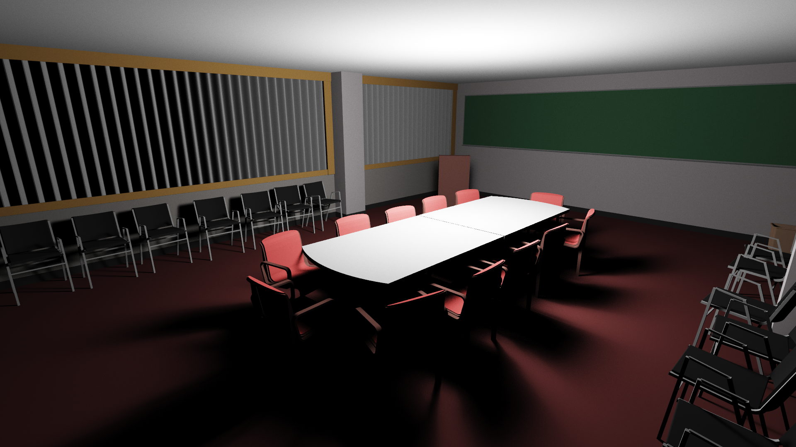
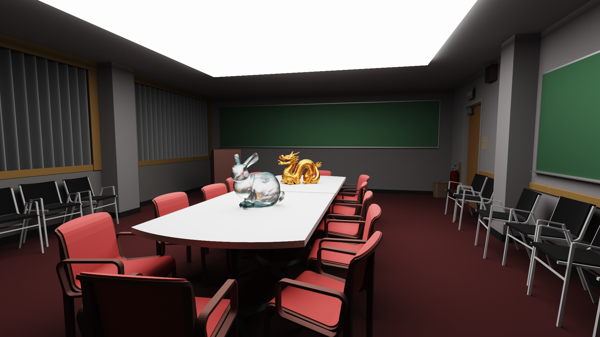
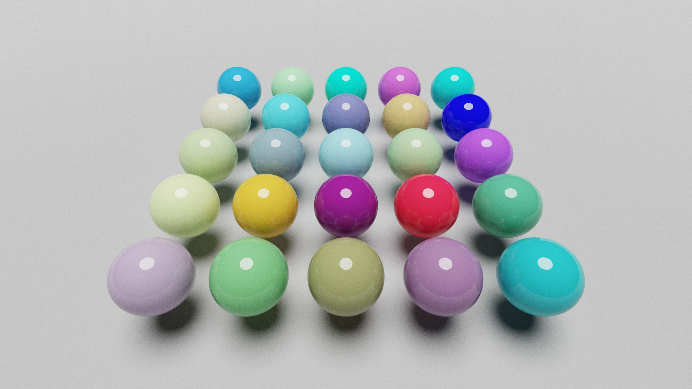
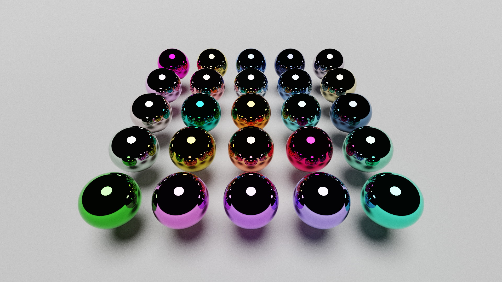
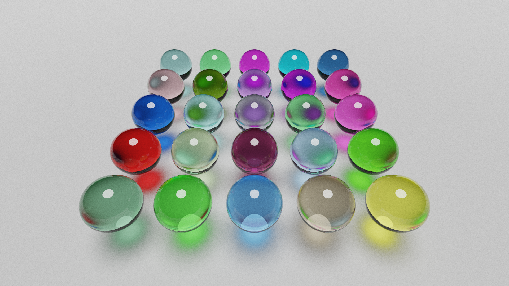
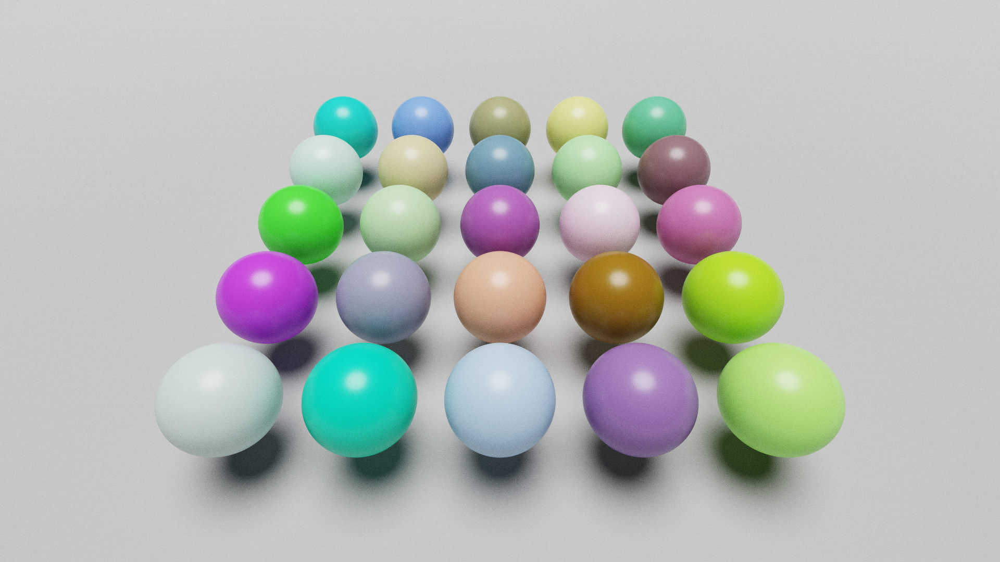
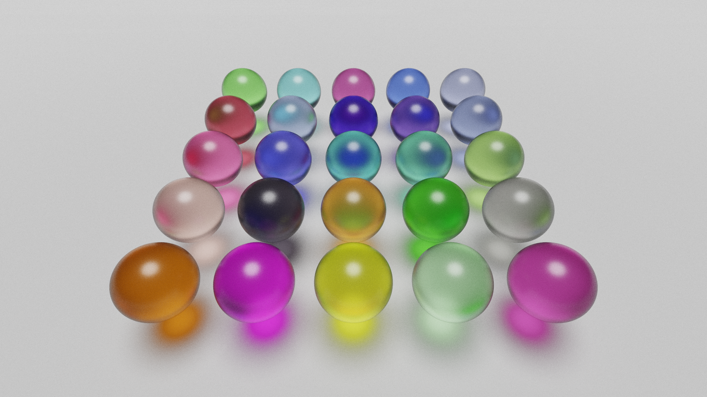
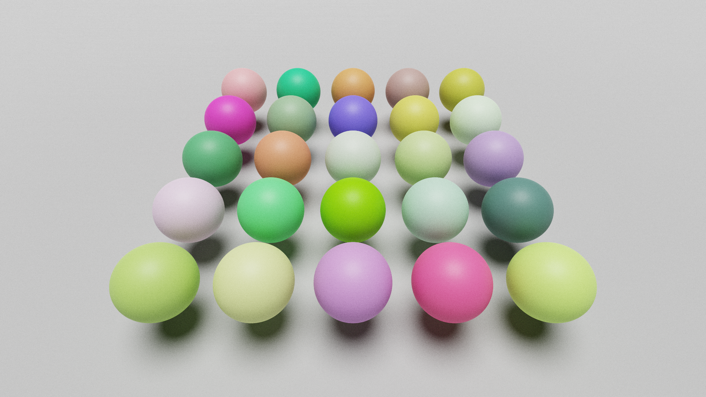
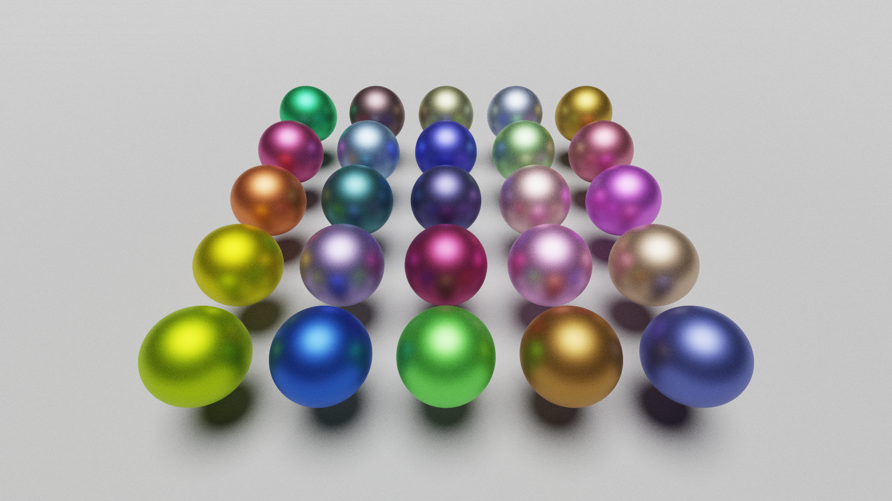
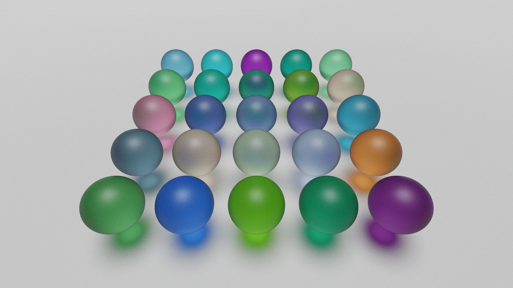

# RT_CPU

## Présentation

Ceci est une version ameliorée d'un projet de lancer de rayons sur CPU réalisé durant ma première année du master ISICG. Le projet consistait à créer de toute pièce un moteur de rendu offline basé sur du lancer de rayons.

Le moteur est ainsi capable de gérer différents types de géométrie :
- analytique : plan, sphère et triangle
- implicite : plan, sphère, cube, cylindre, tore et certaines figures fractales

Le moteur intègre aussi deux méthodes de rendu : 
- direct lighting par sampling de primitive de lumière (directionelle, point, spot, sphérique)
- path tracing avec importance sampling

D'autres améliorations ont aussi été réalisées comme : 
- la création de structures accélératrices (AABB et BVH) qui ont pour vocation de grandement accélérer les calculs
- le support de différents types de caméra (orthographique et perspective)
- la gestion des matériaux transparents 

## Résultats

| Direct lighting | Path tracing  |
| - | - |
|  |  |

| Mandelbulb and julia set | Appolonius |
| - | - |
|  |  |

| Roughness | Dielectric | Metalic | Transmit |
| - | - | - | - |
| 0 |  |  |  |
| 0.3 |  |  |  |
| 0.5 |  |  |  |

# Future ajouts

Plusieurs ajouts sont en vue dans ce moteur :
- la gestion d'un nouveaux type de géométrie (paramétrique : bezier patch/curve et NURBS)
- la gestion de géométrie implicite 2D ()
- l'ajout de nouveau type de géométrie implicite 3D ()
- l'ajout de nouveau type de géométrie implicite fractale 3D ()
- l'ajout de support pour les oppérateur de modélisation par CSG des objets à géométrie implicite
- l'ajout de support pour des nouveaux type de caméra (panoramique et fisheye)
- l'ajout de support pour des nouveaux type de basic lights (Goniophotometric Diagram Map or IES profile)
- l'ajout de support pour des nouveaux type de surfasic lights (cylinder et disk)
- l'ajout de support pour les environement map
- l'amélioration de la méthode de rendu par l'utilisation de NEE et de bidirectional path tracing
- la gestion des textures (albedo, normal, metalness/roughness/transmitness)
- l'amélioration de la BSDF (ajout clearcoat, sheen, anisotropie, ggx mutiscatering/energie compensation)
- l'ajout d'effets de post-processing (AgX, denoiser)