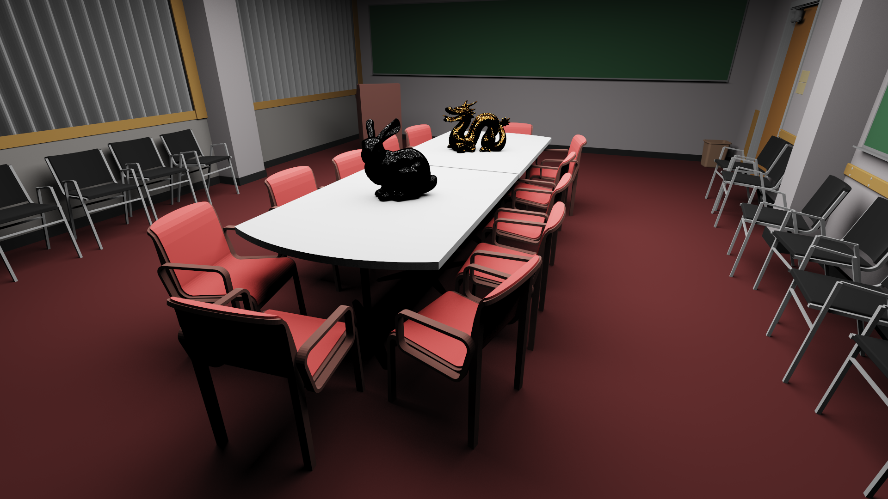

# RT_CPU

## Présentation

Ceci est une version ameliorée d'un projet de lancer de rayons sur CPU réalisé durant ma première année du master ISICG. Le projet consistait à créer de toute pièce un moteur de rendu offline basé sur du lancer de rayons.

Le moteur est ainsi capable de gérer différents types de géométrie :
- analytique : plan, sphère et triangle
- implicite : plan, sphère, cube, cylindre, tore et certaines figures fractales

Le moteur intègre aussi deux méthodes de rendu : 
- direct lighting par sampling de primitive de lumière (directionelle, point, spot, sphérique)
- path tracing avec importance sampling

D'autres améliorations ont aussi été réalisées comme : 
- la création de structures accélératrices (AABB et BVH) qui ont pour vocation de grandement accélérer les calculs
- le support de différents types de caméra (orthographique et perspective)
- la gestion des matériaux transparents 

## Résultats

| Direct lighting | Path tracing  |
| - | - |
|  |  |

| Mandelbulb and julia set | Appolonius |
| - | - |
|  |  |

| Roughness 0.01 | Roughness 0.05 | Roughness 0.3 |
| - | - | - |
|   |   |   |
